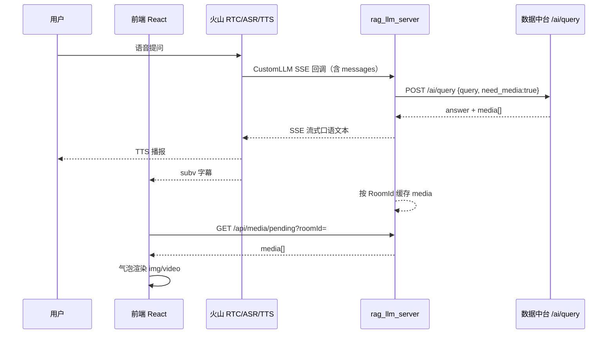

# 多模态回复落地方案（文字 + 图片/视频）

> 项目：`1-chat-ai-agent`（火山 RTC 语音对话）  
> 依赖能力：`6-AI数据中台` 的 `POST /api/v1/ai/query`  
> 文档日期：2026-07-23  
> 状态：待评审 / 待开发

---

## 1. 需求说明

### 1.1 业务目标

用户在语音对话中提问时，系统除语音播报文字外，还能在对话界面同步展示相关图片或视频。

**典型场景：**


| 用户问句            | 期望效果                                  |
| --------------- | ------------------------------------- |
| 「我们学 RAG 有什么用？」 | 语音口语解释 RAG 价值；同时展示「RAG 高薪就业」相关图片或讲解视频 |
| 「怎么退货？」         | 语音说明退货步骤；同时展示步骤图 / 操作演示视频             |


### 1.2 功能需求

1. **文字回复**：继续通过现有语音链路（ASR → LLM → TTS）口语播报，字幕同步显示。
2. **媒体回复**：命中知识后，在对话气泡中渲染关联 `image` / `video`。
3. **未命中兜底**：中台未命中时，行为与现网一致（走方舟/RAG 纯文本，或礼貌告知无资料），不阻断通话。
4. **可运营**：知识条目、素材上传、知识-媒体绑定在数据中台完成，本项目不重复建设素材库。
5. **可配置**：支持开关多模态、中台地址、API Key、超时时间等。

### 1.3 非功能需求


| 项    | 要求                                         |
| ---- | ------------------------------------------ |
| 语音体验 | TTS 只念口语文本，**禁止朗读 URL / Markdown / 媒体文件名** |
| 时延   | 中台查询建议超时 ≤ 1.5s；超时则降级为纯文本                  |
| 可用性  | 中台不可用时，语音对话仍可用                             |
| 安全   | 中台 API Key 仅放服务端；媒体 URL 需浏览器可访问            |
| 范围   | MVP 不做向量检索升级、不做 OSS；复用中台一期能力               |


### 1.4 明确不做（本期）

- 不在火山 CustomLLM SSE 里塞图片/视频二进制或 Markdown 图链。
- 不在本仓库重写素材库、知识绑定、批量导入。
- 不改造 TTS 去「播视频」。
- 不依赖 Vision（摄像头输入）能力出图。

---

## 2. 现状与约束

### 2.1 本项目（`1-chat-ai-agent`）

当前链路：

```
用户说话 → 火山 ASR → POST /api/chat_callback（CustomLLM）
  → 可选火山知识库 RAG（纯文本）
  → 方舟 Ark 流式文本 SSE
  → 火山 TTS 播报 + subv subv
```

关键约束：


| 层             | 现状                       | 影响                   |
| ------------- | ------------------------ | -------------------- |
| CustomLLM SSE | 仅 `delta.content` 字符串    | 媒体不能走该通道，否则会被 TTS 朗读 |
| 前端 `Msg`      | 只有 `value: string`       | 无法承载图/视频元数据          |
| RTC 消息        | `subv` / `conv` / `tool` | 无媒体附件类型              |
| Scene Prompt  | 要求口语化、避免 Markdown        | 适合语音，不适合图文混排输出       |


### 2.2 数据中台（`6-AI数据中台`）

已具备 MVP：

- `POST /api/v1/ai/query`：返回 `answer` + `media[]`（含可访问 URL）
- 素材上传、知识绑定、批量导入、Demo 页 `/demo` 渲染图/视频
- 设计定位：**供外部智能客服系统调用**

响应契约摘要：

```json
{
  "code": 0,
  "data": {
    "matched": true,
    "items": [{
      "knowledge_id": 1,
      "title": "退货流程",
      "answer": "请按图示步骤操作，也可观看演示视频。",
      "score": 25.04,
      "media": [
        {
          "id": 1,
          "type": "image",
          "url": "http://.../media_files/demo/return_step1.jpg",
          "name": "退货步骤图",
          "caption": "步骤示意"
        },
        {
          "id": 2,
          "type": "video",
          "url": "http://.../media_files/demo/return_demo.mp4",
          "name": "退货操作视频",
          "caption": "操作演示"
        }
      ]
    }]
  }
}
```

一期匹配策略为关键词/包含匹配（非向量），对 FAQ 类问题够用。

### 2.3 方案选型结论


| 方案                  | 结论                 |
| ------------------- | ------------------ |
| A. 调用数据中台 + 本项目适配展示 | **采用**。更快落地，复用运营能力 |
| B. 本项目自建多模态知识/素材体系  | 不采用。重复建设，周期长       |


**核心原则：中台管「知识 + 媒体资产」；本项目管「语音对话 + UI 展示」。**

---

## 3. 总体架构

### 3.1 目标链路

```
用户说话
  → 火山 ASR（得到用户文本）
  → rag_llm_server /api/chat_callback
       ├─① 调数据中台 POST /api/v1/ai/query（need_media=true）
       ├─② 将口语文本写入 SSE → 火山 TTS 播报
       └─③ 将 media[] 写入会话媒体暂存（按 RoomId）
  → 前端轮询/拉取 GET /api/media/pending?roomId=...
  → Conversation 气泡渲染文字字幕 + 图片/视频
```




### 3.2 通道分工（必须遵守）


| 通道                  | 内容                       | 消费者                  |
| ------------------- | ------------------------ | -------------------- |
| CustomLLM SSE → TTS | 仅口语短文本（2～4 句），禁止 URL     | 耳朵 / 字幕              |
| HTTP 媒体侧通道          | `image` / `video` URL 列表 | 眼睛 / Conversation UI |
| 现有火山 RAG（可选）        | 文本参考资料                   | LLM 润色（可选增强）         |


### 3.3 回复策略（MVP 推荐）

**策略 S1（最快落地，推荐 MVP）：**

1. 中台命中：SSE 播报 `items[0].answer`（可再做轻量口语清洗）；媒体走侧通道。
2. 中台未命中：回退现有方舟流式回复（可继续叠加火山 RAG）。
3. 中台超时/失败：同未命中，降级纯文本。

**策略 S2（后续增强）：**

1. 中台命中后，把 `answer` + 标题注入 system/user 上下文，再经方舟润色成更自然口语。
2. 媒体仍用中台 URL，不经 LLM 改写。

MVP 先做 **S1**，联调通过后再评估是否上 S2。

---

## 4. 详细设计

### 4.1 后端模块划分（`rag_llm_server`）


| 模块       | 建议路径                                      | 职责                                        |
| -------- | ----------------------------------------- | ----------------------------------------- |
| 中台客户端    | `rag_llm_server/data_platform_client.py`  | 封装 `POST /api/v1/ai/query`、health、超时与错误处理 |
| 媒体会话缓存   | `rag_llm_server/media_session_store.py`   | 按 `room_id` 暂存待拉取媒体，支持 TTL、弹出式消费          |
| 回调编排     | `rag_llm_server/main.py` → `sse_stream()` | 先查中台，再决定 SSE 文本来源；命中则缓存 media             |
| 媒体拉取 API | `GET /api/media/pending`                  | 前端拉取并清空该房间待展示媒体                           |
| 配置       | 环境变量 + 可选 Scene 扩展字段                      | 开关、Base URL、API Key、超时                    |


### 4.2 RoomId 关联（关键）

火山 CustomLLM 回调体以 OpenAI chat 格式为主，**不一定带 RoomId**。本项目 Demo 场景 `RoomId` 常固定为 `ChatRoom01`，但生产可能动态生成。

MVP 关联方案（二选一，推荐 A）：

**方案 A（推荐 MVP）：单活跃房间 + 配置默认 RoomId**

- 环境变量 `DEFAULT_MEDIA_ROOM_ID`（默认读 `Custom.json` 的 `RTCConfig.RoomId`）
- `chat_callback` 命中媒体后写入该 RoomId
- 前端用当前 RTC `roomId` 拉取
- 限制：同时多房间并发时会串；适合当前单 Demo 房

**方案 B（后续）：请求头/扩展字段传 RoomId**

- 在 `StartVoiceChat` 或回调鉴权扩展中携带 RoomId
- 缓存键改为真实 RoomId
- 支持多房间

文档要求：MVP 实现 A，代码预留按 RoomId 索引的结构，方便升级 B。

### 4.3 媒体暂存契约

内存结构示例：

```python
# key = room_id
{
  "ChatRoom01": [
    {
      "id": "uuid",
      "created_at": 1720000000.0,
      "query": "学RAG有什么用",
      "title": "RAG就业价值",
      "answer": "学 RAG 能帮你做企业知识问答……",
      "media": [
        {"id": 1, "type": "image", "url": "http://...", "name": "...", "caption": "..."},
        {"id": 2, "type": "video", "url": "http://...", "name": "...", "caption": "..."}
      ]
    }
  ]
}
```

规则：

- TTL：默认 120 秒，过期自动丢弃
- `GET /api/media/pending`：**弹出**（读后清空），避免重复渲染
- 单房间队列上限：例如最多保留最近 5 条

### 4.4 新增 API

#### 4.4.1 `GET /api/media/pending`

**Query：**


| 参数     | 必填  | 说明           |
| ------ | --- | ------------ |
| roomId | 是   | 当前 RTC 房间 ID |


**响应：**

```json
{
  "code": 0,
  "data": {
    "items": [
      {
        "id": "uuid",
        "title": "RAG就业价值",
        "answer": "……",
        "media": [
          {"id": 1, "type": "image", "url": "http://...", "name": "高薪就业", "caption": null}
        ]
      }
    ]
  }
}
```

无数据时：`items: []`。

#### 4.4.2 `GET /api/media/health`

聚合探测：本服务存活 + 中台 `/api/v1/ai/health` 是否可达。

### 4.5 中台调用封装

```http
POST {DATA_PLATFORM_BASE_URL}/api/v1/ai/query
Content-Type: application/json
X-API-Key: {DATA_PLATFORM_API_KEY}   # 若中台配置了 API_KEY

{
  "query": "<用户最近一句>",
  "limit": 3,
  "need_media": true
}
```

处理逻辑：

1. `code != 0` → 视为失败，降级
2. `matched == false` 或 `items` 空 → 未命中，降级方舟
3. 取 `items[0]`：
  - `answer` → SSE 文本源（S1）
  - `media` 非空 → 写入 session store
  - `media` 为空 → 仅播文字，不推媒体

口语清洗（建议）：

- 去掉 Markdown 符号、多余换行
- 若答案过长，截断到适合 TTS 的长度（例如 120～180 字），或只取前 2～4 句
- **绝对不要**把 `media.url` 拼进 SSE

### 4.6 前端改造

#### 4.6.1 扩展消息模型（`src/store/slices/room.ts`）

```ts
export interface MsgMedia {
  id: number | string;
  type: 'image' | 'video' | 'audio' | 'file' | string;
  url: string;
  name?: string;
  caption?: string | null;
}

export interface Msg {
  value: string;
  time: string;
  user: string;
  paragraph?: boolean;
  definite?: boolean;
  isInterrupted?: boolean;
  // 新增
  media?: MsgMedia[];
  mediaTitle?: string;
}
```

新增 action：`attachMediaToLatestAIMsg` 或 `appendMediaMsg`：

- 优先挂到**最近一条 AI 完整字幕消息**上
- 若尚无 AI 消息（竞态），可暂存后合并，或插入一条仅含媒体的 AI 气泡

#### 4.6.2 媒体轮询（新建 hook，如 `src/lib/useMediaPending.ts`）

- 进房且 Agent 启动后开始轮询
- 间隔：800ms～1500ms（可配置）
- 调用 `GET {rag_llm_server}/api/media/pending?roomId=...`
- 有数据则 dispatch 到 Redux
- 离房/停 Agent 时停止轮询

> 后续可升级为 SSE/WebSocket，MVP 用轮询足够。

#### 4.6.3 Conversation 渲染（`Conversation.tsx`）

在 AI 气泡文字下方：

- `type === 'image'` → ``
- `type === 'video'` → `<video controls src={url} />`
- 其他类型 → 外链 `<a>`

样式注意：

- 图片最大宽度适配气泡（桌面/移动）
- 视频不要自动播放有声（避免和 TTS 抢声）
- 加载失败显示占位文案

可参考数据中台 `frontend/src/pages/DemoChat/index.jsx` 的渲染逻辑。

#### 4.6.4 API 客户端

在 `src/app/base.ts` 或新建 `src/app/media.ts` 增加 `fetchPendingMedia(roomId)`，指向 `rag_llm_server`（与 `/getScenes`、`/proxy` 同源或按现有代理配置）。

### 4.7 配置项


| 环境变量                       | 默认                      | 说明               |
| -------------------------- | ----------------------- | ---------------- |
| `DATA_PLATFORM_ENABLED`    | `false`                 | 总开关              |
| `DATA_PLATFORM_BASE_URL`   | `http://127.0.0.1:8000` | 中台地址             |
| `DATA_PLATFORM_API_KEY`    | 空                       | 对应中台 `X-API-Key` |
| `DATA_PLATFORM_TIMEOUT_MS` | `1500`                  | 查询超时             |
| `DATA_PLATFORM_LIMIT`      | `3`                     | topN             |
| `DEFAULT_MEDIA_ROOM_ID`    | `ChatRoom01`            | MVP 媒体房间键        |
| `MEDIA_PENDING_TTL_SEC`    | `120`                   | 媒体暂存 TTL         |


中台侧务必配置可被浏览器访问的 `PUBLIC_BASE_URL`，否则前端 `/<video>` 打不开。

### 4.8 与现有火山 RAG 的关系


| 模式          | 行为                        |
| ----------- | ------------------------- |
| 仅中台         | MVP：命中用中台；未命中用方舟          |
| 中台 + 火山 RAG | 未命中中台时再走火山知识库文本 RAG（现有逻辑） |
| 双命中融合       | 后续再做；MVP 不做复杂融合，避免答案冲突    |


建议配置优先级：

```
DATA_PLATFORM_ENABLED=true 时：
  先中台 → 命中则播中台 answer + 推媒体
  未命中 → 现有 RAG（若开启）→ 方舟
```

---

## 5. 实现步骤

### 阶段 0：联调准备（0.5 天）

1. 启动数据中台 backend（默认 `:8000`），执行 `seed_demo`（或导入 RAG 演示知识 + 媒体）。
2. 用 Swagger / curl 验证：
  - `POST /api/v1/ai/query`，问句如「怎么退货」或业务定制问句「学RAG有什么用」
  - 浏览器直接打开返回的 `media.url`
3. 确认本项目 `rag_llm_server` 与前端可同时运行。
4. 准备一条业务演示知识（标题/问法/关键词/answer/绑定图或视频），`status=published`。

**验收：** 中台单独 Demo 页 `/demo` 能出文字 + 图/视频。

---

### 阶段 1：后端中台客户端 + 缓存（1～1.5 天）

1. 新增 `data_platform_client.py`：
  - `query_ai(query, limit, need_media) -> AiQueryData | None`
  - 超时、异常返回 `None`
2. 新增 `media_session_store.py`：
  - `push(room_id, payload)`
  - `pop_all(room_id) -> list`
  - TTL 清理
3. 新增环境变量读取与日志：`[DataPlatform] matched=... media=N`

**验收：** 单测/脚本调用 client，能打印命中结果；store push/pop 正常。

---

### 阶段 2：改造 `chat_callback` 编排（1～1.5 天）

在 `rag_llm_server/main.py` 的 `sse_stream()` 中：

1. 从 `messages` 提取最近一条 user content。
2. 若 `DATA_PLATFORM_ENABLED`：
  - 调中台
  - 命中：
    - `push` 媒体到 `DEFAULT_MEDIA_ROOM_ID`（或解析到的 roomId）
    - 将 `answer` 清洗后按字符/分片 `yield` SSE（复用现有 fake_reply 分片方式即可）
    - `yield data: [DONE]` 后 return
  - 未命中/失败：走现有 `_prepare_messages_with_rag` + `_call_ark_stream`
3. 保证中台路径也输出合法 OpenAI chunk 格式，避免火山侧报错。

**验收：** 用 curl 模拟 CustomLLM 请求，SSE 只有口语文本；同时 `GET /api/media/pending` 能拉到 media。

---

### 阶段 3：媒体拉取 API（0.5～1 天）

1. 实现 `GET /api/media/pending`
2. 处理 CORS（若前端端口不同）
3. （可选）`GET /api/media/health`

**验收：** Postman/浏览器连续两次拉取，第二次为空（弹出语义正确）。

---

### 阶段 4：前端展示（1.5～2 天）

1. 扩展 `Msg` 与 Redux action
2. 实现 `useMediaPending` 轮询
3. 改造 `Conversation.tsx` 渲染图/视频
4. 补充样式（参考 DemoChat，贴合现有气泡风格）
5. 进房启动 / 离房停止轮询

**验收：** 语音问「怎么退货」或业务问句，听到播报的同时看到图/视频。

---

### 阶段 5：Prompt / 体验打磨（0.5～1 天）

1. 中台命中时，TTS 文本控制在 2～4 句。
2. 视频默认静音或不自动播放。
3. 用户打断（interrupt）时：已弹出媒体可保留；未拉取的过期即可。
4. 失败降级提示仅在必要时出现，避免频繁「查询失败」打断体验。

---

### 阶段 6：联调与演示验收（1 天）

1. 端到端脚本/人工用例（见第 7 节）
2. 中台宕机降级验证
3. 媒体 URL 跨机访问验证（改 `PUBLIC_BASE_URL`）
4. 整理演示话术与知识条目

---

## 6. 目录与改动清单（预计）

### 本仓库新增/修改

```
rag_llm_server/
  data_platform_client.py      # 新增
  media_session_store.py       # 新增
  main.py                      # 修改：编排 + pending API
  .env.example                 # 新增/补充环境变量说明
  scenes/Custom.json.example   # 可选：注释说明多模态依赖中台

src/
  store/slices/room.ts         # 扩展 Msg / action
  lib/useMediaPending.ts       # 新增轮询
  app/media.ts                 # 新增 API
  pages/MainPage/MainArea/Room/Conversation.tsx
  pages/MainPage/MainArea/Room/index.module.less  # 媒体样式

docs/
  多模态回复落地方案.md         # 本文档
```

### 数据中台侧（通常少改代码，偏运营配置）

1. 上传/同步 RAG 相关图片、视频到素材库
2. 创建知识：问法「学RAG有什么用」、关键词 `RAG,就业,高薪` 等
3. 绑定媒体，发布 `published`
4. 确认 `PUBLIC_BASE_URL` 对前端可达
5. 如需鉴权，配置 `API_KEY` 并同步到本项目环境变量

---

## 7. 测试计划

### 7.1 功能用例


| 编号  | 用例                  | 期望                 |
| --- | ------------------- | ------------------ |
| T1  | 中台已发布「怎么退货」知识且含图+视频 | 语音播 answer；气泡出图和视频 |
| T2  | 问无关问题               | 无媒体；走方舟/RAG 文本     |
| T3  | 中台停止服务              | 通话不中断，纯文本回复        |
| T4  | 中台命中但 media 空       | 仅文字，无报错            |
| T5  | 连续两问都命中媒体           | 两次都能展示，不串成一条       |
| T6  | 用户打断播报              | 通话正常；媒体不导致崩溃       |
| T7  | 移动端布局               | 图片/视频不撑破气泡         |


### 7.2 接口自测示例

```bash
# 1) 中台查询
curl -X POST http://127.0.0.1:8000/api/v1/ai/query \
  -H "Content-Type: application/json" \
  -d "{\"query\":\"怎么退货\",\"need_media\":true,\"limit\":3}"

# 2) 媒体 pending（联调后端后）
curl "http://127.0.0.1:<rag_port>/api/media/pending?roomId=ChatRoom01"
```

### 7.3 演示话术建议

1. 「你好」→ 欢迎语（无媒体）
2. 「怎么退货」→ 文字 + 图/视频（验证闭环）
3. 「学 RAG 有什么用」→ 业务定制知识 + 就业相关媒体
4. 「今天天气怎么样」→ 降级纯文本（验证未命中）

---

## 8. 风险与对策


| 风险                             | 影响           | 对策                             |
| ------------------------------ | ------------ | ------------------------------ |
| SSE 误带 URL                     | TTS 朗读链接，体验差 | 严格分离通道；代码层禁止拼接 media.url       |
| `PUBLIC_BASE_URL` 配成 localhost | 远端浏览器无法加载媒体  | 部署文档强调公网/局域网可达地址               |
| RoomId 关联不准                    | 媒体推错房或拉不到    | MVP 单房；后续传真实 RoomId            |
| 关键词召回不准                        | 问法稍变就未命中     | 运营补充 keywords/question；后续中台上向量 |
| 轮询增加请求                         | 轻微负载         | 仅进房轮询；间隔 ≥800ms；离房停止           |
| 视频与 TTS 抢声                     | 吵杂           | 视频不自动播放，或默认 muted              |
| 双知识源答案冲突                       | 用户困惑         | MVP 命中中台则不再混火山 RAG 答案          |


---

## 9. 工期与里程碑


| 阶段     | 内容               | 预估           |
| ------ | ---------------- | ------------ |
| 0      | 联调准备 / 演示语料      | 0.5 天        |
| 1      | 中台 client + 缓存   | 1～1.5 天      |
| 2      | chat_callback 编排 | 1～1.5 天      |
| 3      | pending API      | 0.5～1 天      |
| 4      | 前端展示             | 1.5～2 天      |
| 5      | 体验打磨             | 0.5～1 天      |
| 6      | 联调验收             | 1 天          |
| **合计** |                  | **约 6～9 人天** |


里程碑：

- **M1**：后端可 curl 验证「SSE 文本 + pending 媒体」
- **M2**：前端语音对话可见图/视频
- **M3**：业务问句「学 RAG 有什么用」演示通过

---

## 10. 上线检查清单

- [ ] `DATA_PLATFORM_ENABLED=true`
- [ ] `DATA_PLATFORM_BASE_URL` 指向正确环境
- [ ] API Key 配置一致（如启用）
- [ ] 中台 `PUBLIC_BASE_URL` 浏览器可打开样例图片
- [ ] 演示知识已 `published` 且绑定媒体
- [ ] TTS 抽测无朗读 URL
- [ ] 中台宕机降级抽测通过
- [ ] 移动端气泡展示抽测通过

---

## 11. 后续演进（不在本期）

1. RoomId 精确关联（多房间）
2. 轮询升级为 WebSocket/SSE 推送
3. 策略 S2：方舟润色中台 answer
4. 中台向量检索（pgvector）提升召回
5. 媒体改存 OSS/CDN，静态资源鉴权
6. 会话历史落库（中台 conversations 目前为占位）

---

## 12. 参考资料


| 资源      | 路径                                                            |
| ------- | ------------------------------------------------------------- |
| 中台接口说明  | `E:/AI/zwl_ai/6-AI数据中台/docs/接口说明.md` §4.1                     |
| 中台方案设计  | `E:/AI/zwl_ai/6-AI数据中台/docs/方案设计.md`                          |
| 中台 Demo | `E:/AI/zwl_ai/6-AI数据中台/frontend/src/pages/DemoChat/index.jsx` |
| 本项目回调入口 | `rag_llm_server/main.py` → `/api/chat_callback`               |
| 本项目消息模型 | `src/store/slices/room.ts`                                    |
| 本项目字幕处理 | `src/utils/handler.ts`                                        |
| 场景配置示例  | `rag_llm_server/scenes/Custom.json.example`                   |


---

**文档结束。** 确认本方案后，建议按「阶段 0 → 阶段 2 → 阶段 4」优先打通端到端垂直切片，再补齐打磨与降级。