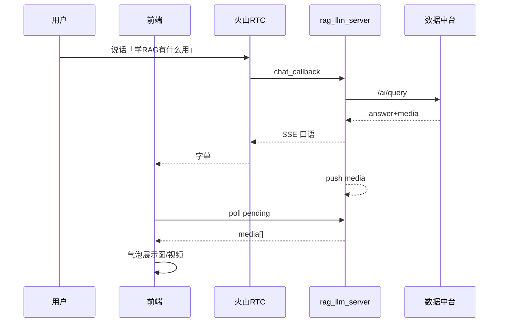

# 阶段4完成报告：前端多模态展示

> 对应方案：`docs/多模态回复落地方案.md` §阶段 4  
> 完成日期：2026-07-24  
> 状态：**代码完成并通过自动化自验证；UI 真机语音需你本地确认一眼**

---

## 1. 目标回顾

| 目标项 | 结果 |
|--------|------|
| 扩展 `Msg` 支持 media | ✅ |
| Redux `attachMediaToLatestAIMsg` | ✅ |
| `fetchPendingMedia` + `useMediaPending` 轮询 | ✅ |
| Room 进房挂载轮询 | ✅ |
| Conversation 渲染 img / video | ✅ |
| 视频不自动播有声 | ✅（`controls`，无 autoPlay） |
| 后端 0~3 回归 | ✅ |

---

## 2. 新增文件清单

| 文件 | 说明 |
|------|------|
| `src/app/media.ts` | **新增**：pending / health 客户端 |
| `src/lib/useMediaPending.ts` | **新增**：进房轮询 hook（1s） |
| `src/store/slices/room.ts` | **修改**：`MsgMedia`、`attachMediaToLatestAIMsg` |
| `src/pages/MainPage/MainArea/Room/index.tsx` | **修改**：挂载 `useMediaPending` |
| `src/pages/MainPage/MainArea/Room/Conversation.tsx` | **修改**：气泡内渲染图/视频 |
| `src/pages/MainPage/MainArea/Room/index.module.less` | **修改**：媒体样式 |
| `docs/scripts/phase4_self_check.py` | 自检 |
| `docs/phase4_self_check.json` | 快照 |
| `docs/阶段4完成报告.md` | 本报告 |

---

## 3. 架构说明

```
进房 + Agent 启动
  → useMediaPending 每 1s
      GET http://localhost:3001/api/media/pending?roomId=...
      → attachMediaToLatestAIMsg
      → Conversation 渲染 /<video>

语音链路（已有）：
  ASR → chat_callback → 中台命中
    → SSE 文字（TTS）
    → store.push(media)
```



---

## 4. 关键设计取舍

| 取舍 | 选择 | 原因 |
|------|------|------|
| 推送方式 | HTTP 轮询 1s | MVP 简单；WS 留后续 |
| 媒体挂载 | 挂最近 AI 气泡；没有则新建 | 覆盖字幕晚于 pending 的竞态 |
| 去重 | 同 `type+url` 不重复加 | 防轮询/重入 |
| 视频 | controls、无 autoPlay | 避免与 TTS 抢声 |
| 媒体 URL | 直接用中台返回 URL | 本机联调 `localhost:8000` 可达 |

---

## 5. 测试结果

### 5.1 自动化

```powershell
cd rag_llm_server
$env:LIVE_BASE='http://127.0.0.1:3001'
python ../docs/scripts/phase4_self_check.py
```

| 用例 | 结果 |
|------|------|
| 前端关键文件与标记存在 | ✅ |
| health / callback / pending 契约 | ✅ image+video |
| live `:3001` | ✅ |
| phase1 / phase2 / phase3 全量脚本 | ✅ ALL PASS |

### 5.2 人工验收（请你本地点一次）

1. 确保：数据中台 `:8000`、`rag_llm_server` `:3001`、前端 `:3000` 均运行  
2. 浏览器打开语音页，进房  
3. 说或触发：「学RAG有什么用」或「怎么退货」  
4. 期望：听到口语；气泡出现图片 + 可点播视频  

> 占位图/视频文件很小，画面可能几乎看不见，但元素应出现；可在中台换成真实素材增强观感。

---

## 6. FastAPI 接口说明（前端消费）

### 6.1 `GET /api/media/pending`

**前端调用：** `fetchPendingMedia(roomId)` → `${AIGC_PROXY_HOST}/api/media/pending?roomId=`

**入参：**

| 参数 | 位置 | 必填 | 说明 |
|------|------|------|------|
| roomId | Query | 是 | 当前 RTC `room.roomId` |

**出参 → Redux：**

```json
{
  "code": 0,
  "data": {
    "items": [
      {
        "id": "uuid",
        "title": "RAG就业与业务价值",
        "answer": "学 RAG 能帮你……",
        "media": [
          {"id": 148, "type": "image", "url": "http://localhost:8000/media_files/...", "name": "...", "caption": "..."},
          {"id": 149, "type": "video", "url": "http://localhost:8000/media_files/...", "name": "...", "caption": "..."}
        ]
      }
    ]
  }
}
```

**完整数据流：**

```
1) 用户语音 → chat_callback 命中中台 → push(ChatRoom01)
2) 前端 useMediaPending 轮询 pending
3) dispatch(attachMediaToLatestAIMsg({ media, mediaTitle, answer }))
4) Conversation 对 AI 气泡渲染 MediaBlock
5) 再次 pending → items=[]（已弹出）
```

### 6.2 `GET /api/media/health`

调试用；`fetchMediaHealth()` 已封装，默认 UI 不调用。

### 6.3 相关配置

| 项 | 值 |
|----|-----|
| 前端代理主机 | `src/config` → `AIGC_PROXY_HOST=http://localhost:3001` |
| 轮询间隔 | 1000ms |
| 启停条件 | `isJoined && isAIGCEnable && roomId` |

---

## 7. 踩坑汇总

| # | 问题 | 处理 |
|---|------|------|
| 1 | 媒体可能早于字幕到达 | 无 AI 气泡时新建一条带 media 的消息 |
| 2 | 占位媒体肉眼不明显 | 文档提示可换真实素材；协议闭环仍有效 |
| 3 | `RoomId` 动态生成时需与 `DEFAULT_MEDIA_ROOM_ID` 一致 | 当前 Demo 多为 `ChatRoom01`；若 getScenes 动态换房，需阶段后续把真实 roomId 传入 callback（方案 B） |

---

## 8. 下一步操作

MVP 主链路（阶段0~4）代码已齐。建议你：

1. **人工进房验证**气泡图/视频  
2. （可选）阶段5：打断体验、文案长度、视频 muted 等打磨  
3. （可选）中台上传真实「RAG 高薪就业」图/视频并重新绑定  
4. 若动态 RoomId 与默认房不一致导致拉不到媒体，告诉我，我帮你做 RoomId 精确关联  

回复「继续阶段5」或描述你人工验证看到的问题即可。

---

**阶段4验收结论：自动化通过；请补一次浏览器人工确认。**
