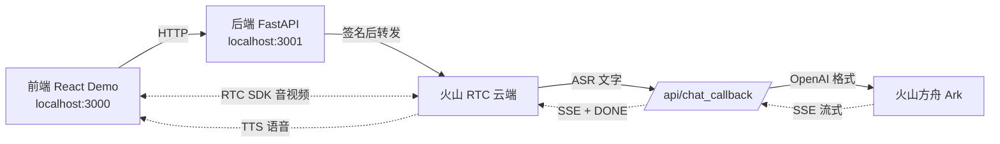
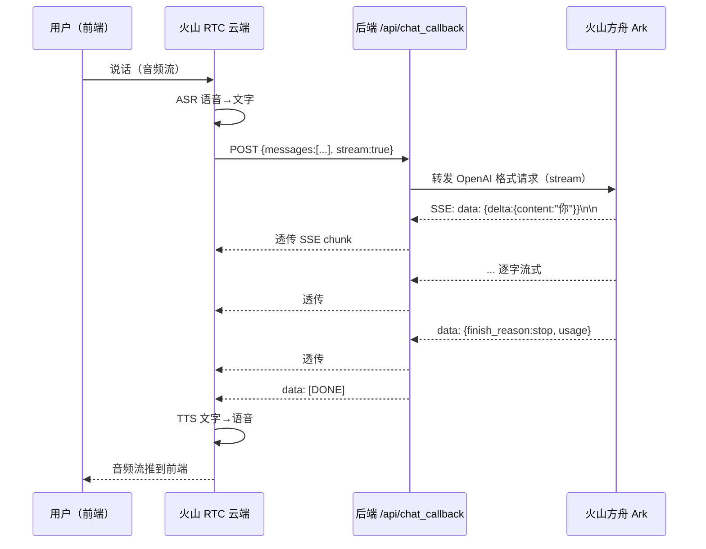

# 实时对话式 AI 后端服务 — 项目复盘

> 项目名称：AIGC Server（Python 实现）
> 仓库路径：`rag_llm_server/`
> 编写时间：2026-07-01
> 状态：**已跑通端到端语音对话链路**

---

## 一、项目概述

本项目是一个 **实时对话式 AI 的后端服务**，基于火山引擎 RTC（实时音视频）能力，实现「用户说话 → AI 语音回答」的完整闭环。

服务承担两类职责：

1. **场景管理与 OpenAPI 代理**：向前端返回 RTC 连接参数，并代理火山 RTC 的 `StartVoiceChat` / `StopVoiceChat` OpenAPI 请求（含 V4 签名）。
2. **第三方 LLM 回调服务（CustomLLM）**：接收火山云端的 LLM 回调请求，转发到火山方舟大模型，并以 SSE 流式协议回传，使整个语音对话链路能够接入自研/第三方大模型。

---

## 二、功能需求

### 2.1 原始需求

对接火山引擎「实时对话式 AI」方案，搭建后端服务，支撑前端 React Demo 完成语音对话。

### 2.2 衍生需求

在原生 `ArkV3`（火山托管 LLM）模式之上，**接入第三方/自研大模型（CustomLLM 模式）**，使得：

- LLM 推理由本服务承担，火山 RTC 仅作为「语音管道」
- 后续可灵活替换后端（方舟 / Dify / RAG / 自研 Agent），火山侧配置不变
- 满足特定业务定制（改 prompt、注入上下文、Function Calling 等）

### 2.3 验收标准

| 编号 | 验收项 | 结果 |
|------|--------|------|
| A1 | 后端服务可启动，提供场景查询与 OpenAPI 代理 | ✅ |
| A2 | CustomLLM 回调接口符合火山接口标准（SSE + `data: [DONE]`） | ✅ |
| A3 | 公网可访问（ngrok），火山云端可回调到本服务 | ✅ |
| A4 | `StartVoiceChat` 可成功启动 CustomLLM 语音任务 | ✅ |
| A5 | 前端 React Demo 加载、加入房间、说话后能听到 AI 语音回答 | ✅ |

---

## 三、技术选型

| 维度 | 选型 | 说明 |
|------|------|------|
| 语言 | Python 3.10+ | 与火山官方 Node Demo 对等移植 |
| Web 框架 | FastAPI 0.115.6 | 原生支持 async、SSE（StreamingResponse）、自动文档 |
| ASGI 服务器 | uvicorn 0.34.0 | 标准 ASGI 实现 |
| HTTP 客户端 | httpx 0.28.1 | 支持 async + 流式请求/响应 |
| 数据校验 | pydantic 2.10.4 | FastAPI 配套 |
| 配置管理 | python-dotenv 1.0.1 | 从 `.env` 加载敏感配置 |
| 公网暴露 | ngrok | 本地开发内网穿透 |
| 大模型 | 火山方舟 Ark（doubao-seed-1-8-251228） | OpenAI 兼容接口 |

依赖清单见 `pyproject.toml`。

---

## 四、系统架构

### 4.1 整体架构



### 4.2 CustomLLM 数据流（核心）



### 4.3 模块组成

```
rag_llm_server/
├── main.py              # FastAPI 入口 + 3 个接口 + CustomLLM 回调
├── util.py              # 场景读取、参数校验、火山 V4 签名、响应包装
├── token_manager.py     # RTC AccessToken 生成/解析
├── scenes/
│   └── Custom.json      # 场景配置（SceneConfig/AccountConfig/RTCConfig/VoiceChat）
├── .env                 # 敏感配置（AK/SK、方舟 Key、ngrok 地址）
└── pyproject.toml       # 依赖管理
```

---

## 五、实现过程（按阶段）

### 阶段 0：基础脚手架（已有）

项目起始即包含从火山官方 Node Demo 移植的 Python 基础实现：

- `main.py`：`/proxy`（OpenAPI 代理）、`/getScenes`（场景查询）
- `util.py`：`read_scenes`、`assert_param`、`sign_volcengine_request`、`APIWrapper`
- `token_manager.py`：RTC Token 生成（HMAC-SHA256 + 二进制打包）
- `scenes/Custom.json`：原始 `ArkV3` 模式场景

此时 LLM 由火山云端直接调方舟，本服务不参与 LLM 环节。

### 阶段 1：理解火山 CustomLLM 接入规范

研读火山官方文档「接入第三方大模型/Agent」，明确关键约束：

| 约束 | 要求 |
|------|------|
| 协议 | HTTP(S)，公网可访问 |
| 方法 | POST |
| 响应 | SSE（`Content-Type: text/event-stream`） |
| 结束符 | 必须 `data: [DONE]`（否则多轮 `HistoryLength` 失效） |
| 首包超时 | 10 秒 |
| 请求体 | OpenAI Chat Completions 格式（`messages`、`stream`、`model` 等） |
| 响应 chunk | OpenAI 兼容 `chat.completion.chunk` |
| 鉴权 | 可选 `Authorization: Bearer <APIKey>` |

### 阶段 2：实现 `/api/chat_callback` 回调接口

在 `main.py` 新增：

1. 加载 `.env`（`load_dotenv`），读取 `ARK_API_KEY`、`ARK_ENDPOINT_ID`、`SERVER_URL`、可选 `CHAT_CALLBACK_TOKEN`
2. `POST /api/chat_callback` 接口
3. `_call_ark_stream`：用 `httpx` 流式转发方舟，透传其 SSE
4. `_fake_reply`：方舟不可用时的假回复兜底（用于第一步链路验证）

关键设计：**回传管道与数据来源解耦**。`StreamingResponse(sse_stream(), media_type="text/event-stream")` 是通用管道，`_call_ark_stream` 只是数据来源之一，后续替换为 Dify/RAG 不影响管道。

### 阶段 3：公网暴露与链路验证

- 使用 ngrok 将本地 3001 端口暴露为公网 HTTPS 地址
- 用 curl 模拟火山回调请求验证 SSE 链路：方舟真实流式回答 + `data: [DONE]` ✅

### 阶段 4：切换 CustomLLM 模式

修改 `scenes/Custom.json` 的 `LLMConfig`：

| 字段 | 改前（ArkV3） | 改后（CustomLLM） |
|------|--------------|-------------------|
| `Mode` | `ArkV3` | `CustomLLM` |
| `EndPointId` | `ep-...` | 移除 |
| `Url` | — | `""`（动态注入） |
| `ModelName` | — | `doubao-seed-1-8-251228` |

并在 `main.py` 增加 `_inject_callback_url()`：启动时从 `.env` 的 `SERVER_URL` 自动注入到 CustomLLM 场景的 `Url`。**好处：ngrok 换地址只改 `.env` 重启即可，不动场景 JSON。**

### 阶段 5：端到端联调

- 启动后端（3001）+ 前端 React Demo（3000）
- 前端 `AIGC_PROXY_HOST = 'http://localhost:3001'` 已对接
- `StartVoiceChat` 返回 `Result: ok` → 火山接受 CustomLLM 配置
- 前端加入房间、说话 → AI 语音回答 ✅

---

## 六、核心模块说明

### 6.1 `main.py` — 入口与接口

启动流程：

1. `load_dotenv()` 加载配置
2. 读取 `ARK_API_KEY` / `ARK_ENDPOINT_ID` / `SERVER_URL` 等环境变量
3. `read_scenes()` 加载 `scenes/*.json`
4. `_inject_callback_url(SCENES)` 注入公网回调地址
5. 创建 FastAPI app，挂载 CORS

提供 3 个接口（详见第七节）。

### 6.2 `util.py` — 工具层

| 函数/类 | 作用 |
|---------|------|
| `read_scenes` | 读取 `scenes/` 下所有 JSON，按文件名（去 `.json`）作为 SceneID |
| `assert_param` | 参数校验，失败抛异常 |
| `sign_volcengine_request` | 火山 V4 签名（HMAC-SHA256），与 `@volcengine/openapi` 行为一致 |
| `APIWrapper.wrap` | 统一响应包装：成功 `{ResponseMetadata, Result}`，失败 `{Error}` |

### 6.3 `token_manager.py` — RTC Token

- `AccessToken`：生成 RTC 房间访问令牌（HMAC-SHA256 + 二进制打包，与 Node `token.js` 对齐）
- 支持发布/订阅权限，可设过期时间
- `parse_token`：反向解析（调试用）

### 6.4 `scenes/Custom.json` — 场景配置

四块结构：

| 区块 | 作用 |
|------|------|
| `SceneConfig` | 前端展示（名称、图标） |
| `AccountConfig` | 火山 AK/SK，用于 OpenAPI 签名 |
| `RTCConfig` | 客户端进房间的 AppId/Token/RoomId/UserId（可选 AppKey 用于自动生成 Token） |
| `VoiceChat` | 语音任务完整参数（Agent、ASR、TTS、LLM） |

---

## 七、接口清单

### 7.1 `POST /getScenes`

**用途：** 返回所有场景及 RTC 连接参数，供前端初始化。

**请求体：** 空

**响应：**

```json
{
  "ResponseMetadata": {"Action": "getScenes"},
  "Result": {
    "scenes": [
      {
        "scene": {"id": "Custom", "name": "自定义助手", "botName": "ChatBot01", ...},
        "rtc": {"AppId": "...", "RoomId": "...", "UserId": "...", "Token": "..."}
      }
    ]
  }
}
```

**内部逻辑：**
- 缺 Token/UserId/RoomId 时用 `AppKey` 自动生成 24h Token
- 提取 UI 字段（是否打断、视觉、数字人等）
- 返回前移除 `AppKey`（防泄露）

> 详见 **§10.6 RTC Token 与 AppKey 配置关系**。

### 7.2 `POST /proxy`

**用途：** 代理火山 RTC OpenAPI。

**Query：** `Action`（`StartVoiceChat` / `StopVoiceChat`）、`Version`（默认 `2024-12-01`）

**请求体：** `{"SceneID": "Custom"}`

**行为：**

| Action | 转发 Body |
|--------|-----------|
| `StartVoiceChat` | 整个 `VoiceChat` 配置 |
| `StopVoiceChat` | `{AppId, RoomId, TaskId}` |

签名使用场景 JSON 里的 `AccountConfig` AK/SK，转发到 `https://rtc.volcengineapi.com`。直接返回火山原始 JSON。

### 7.3 `POST /api/chat_callback`（新增 · 核心）

**用途：** 火山 CustomLLM 回调入口。

**请求：**
- Headers：`Content-Type: application/json`，可选 `Authorization: Bearer <token>`
- Body：OpenAI 格式 `{messages, stream, model, temperature, max_tokens, top_p, ...}`

**响应：** `text/event-stream`，逐 chunk `data: {...}\n\n`，末尾 `data: [DONE]\n\n`。

**实现要点：**
- 优先走真实方舟（`_call_ark_stream`），失败回退假回复（`_fake_reply`）
- 方舟 SSE 透传：`resp.aiter_lines()` 逐行 yield，补 `\n\n` 分隔
- 流式 = 低延迟：方舟吐一个字 → yield → StreamingResponse 推火山 → TTS 转语音

---

## 八、配置说明

### 8.1 `.env`（敏感，已脱敏）

```bash
# 火山引擎 AK/SK（OpenAPI 签名用）
VOLC_ACCESS_KEY=<已脱敏>
VOLC_SECRET_KEY=<已脱敏>

# 方舟推理接入点（CustomLLM 后端）
ARK_ENDPOINT_ID=doubao-seed-1-8-251228
ARK_API_KEY=<已脱敏>

# RTC 应用配置
RTC_APP_ID=<已脱敏>
RTC_APP_KEY=<已脱敏>

# 本地服务的公网地址（火山回调入口，ngrok）
SERVER_URL=https://<your-ngrok>.ngrok-free.dev

# 可选：CustomLLM 回调鉴权 Token（留空不校验）
# CHAT_CALLBACK_TOKEN=<自定义token>
```

### 8.2 配置流向

```
.env (SERVER_URL) ──启动注入──▶ scenes/Custom.json (LLMConfig.Url)
                                  │
                                  ▼
                          StartVoiceChat 时发给火山
                                  │
                                  ▼
                  火山按 Url 回调 /api/chat_callback
                                  │
                                  ▼
             .env (ARK_API_KEY) ──▶ 转发方舟
```

---

## 九、验证过程与结果

### 9.1 验证记录

| 步骤 | 方法 | 结果 |
|------|------|------|
| 1. 本地服务启动 | `python main.py` | `Application startup complete`，监听 3001 |
| 2. 回调接口本地验证 | `curl POST /api/chat_callback` | 方舟真实流式回答 + `[DONE]` ✅ |
| 3. ngrok 公网隧道 | `curl 公网地址/api/chat_callback` | `ERR_NGROK_3200` → 重新建隧道后通过 ✅ |
| 4. 场景配置 | `POST /getScenes` | 200，Custom 场景正常 |
| 5. 启动语音任务 | `POST /proxy?Action=StartVoiceChat` | `Result: ok` + RequestId ✅ |
| 6. 停止语音任务 | `POST /proxy?Action=StopVoiceChat` | `Result: ok` ✅ |
| 7. 前端启动 | `npm start` | `Compiled successfully`，localhost:3000 ✅ |
| 8. 端到端语音对话 | 浏览器说话 | AI 语音回答 ✅ |

### 9.2 关键里程碑

- **第一步链路验证**：CustomLLM SSE 回调契约跑通（`/api/chat_callback` + `data: [DONE]`）
- **第二步模式切换**：`Custom.json` 改为 CustomLLM，`StartVoiceChat` 被火山接受
- **第三步端到端**：前端说话 → 火山 ASR → 回调本服务 → 方舟 → SSE 回传 → 火山 TTS → 前端听到 AI

---

## 十、踩坑记录

### 10.1 ngrok 隧道离线（`ERR_NGROK_3200`）

**现象：** 公网验证返回 ngrok 离线错误页。
**原因：** `.env` 中的 `SERVER_URL` 是历史会话遗留地址，已失效。
**解决：** 重新启动 ngrok，更新 `.env` 的 `SERVER_URL`。后续做成 `_inject_callback_url` 动态注入，避免硬编码。

### 10.2 端口占用（`Errno 10048`）

**现象：** 重启服务时报 `bind on address ('0.0.0.0', 3001)` 失败。
**原因：** 旧 uvicorn 子进程未随主进程退出。
**解决：** `netstat -ano | findstr :3001` 找到 PID，`taskkill /PID /F` 杀掉后重启。

### 10.3 PowerShell 下 curl JSON 转义丢失

**现象：** `curl -d "{\"messages\":...}"` 传到后端时 `messages` 变空数组，方舟报 `minimum length 1, got empty array`。
**原因：** PowerShell 对 `-d` 内引号的解析与 bash 不同。
**解决：** 改用 `--data-binary "@body.json"` 从文件读取，并用引号包裹文件名（`@` 在 PowerShell 中是 splatting 符号）。

### 10.4 `_inject_callback_url` 定义前调用（lint 报错）

**现象：** basedpyright 报 `_inject_callback_url` 未定义。
**原因：** Python 模块顺序执行，调用语句在 `def` 之前。
**解决：** 调整顺序：先定义函数，再 `SCENES = read_scenes()` + `_inject_callback_url(SCENES)`。

### 10.5 `data: [DONE]` 缺失导致多轮上下文失效

**来源：** 火山官方 FAQ。
**结论：** 回调响应必须包含 `data: [DONE]`，否则系统无法判定一轮结束，`HistoryLength` 历史记忆失效。本服务在真实流和假回复流末尾均保证输出 `[DONE]`。

### 10.6 RTC Token 与 AppKey 配置关系

**现象：** 删掉 `Custom.json` 里的 `Token` 后，前端进不了 RTC 房间；或填了 `AppKey: ""` 空字符串，报「AppKey 不可为空」。

**背景：** 前端进房依赖 `/getScenes` 返回的 `rtc.Token`。Token 有两种来源：

| 方式 | 配置 | 行为 |
|------|------|------|
| **手动填 Token** | `RTCConfig.Token` 填控制台生成的长串 | 每次 `/getScenes` 直接返回该 Token，**不**自动生成 |
| **临时自动生成** | `Token` 留空 + `AppKey` 填真实值 | 每次 `/getScenes` 用 `AppKey` 现场算一个新 Token（有效期 24h） |

**推荐配置（已验证可跑通）：**

```json
"RTCConfig": {
  "AppId": "<your-rtc-app-id>",
  "AppKey": "<your-rtc-app-key>",
  "RoomId": "ChatRoom01",
  "UserId": "Huoshan01",
  "Token": ""
}
```

**触发自动生成的条件**（`main.py` `/getScenes`）：

```python
if app_id and (not token or not user_id or not room_id):
    app_key = rtc_config.get("AppKey")
    # AppKey 为空则报错
    key = AccessToken(app_id, app_key, room_id, user_id)
    key.expire_time(now + 24h)
    rtc_config["Token"] = key.serialize()
```

**三个概念不要混：**

| 字段 | 在哪 | 作用 | 当前是否被代码读取 |
|------|------|------|-------------------|
| `RTCConfig.Token` | `Custom.json` | 前端进 RTC 房间的凭证 | ✅ `/getScenes` 直接返回 |
| `RTCConfig.AppKey` | `Custom.json` | Token 为空时，用于**签名生成**新 Token | ✅ 仅自动生成时用 |
| `RTC_APP_KEY` | `.env` | 文档/模板预留 | ❌ **`main.py` 目前不读** |

**「临时生成」的含义：**

- **临时** = 请求时现场计算，不是写死在配置文件里
- 生成结果只存在于本次内存，**不会写回** `Custom.json`
- Token 有效期 **24 小时**，过期需重新进房（会再次自动生成）或改回手动填 Token
- 返回给前端前会 `pop("AppKey")`，避免 AppKey 泄露

**常见错误：**

1. `Token: ""` 且 `AppKey: ""` → `/getScenes` 报错，语音客服不可用（后端 `python main.py` 仍能启动）
2. 把 **Token 字符串** 填进 `AppKey` → 生成的 Token 无效，进房失败（AppKey 是控制台「应用密钥」，比 Token 短）
3. 以为 `.env` 的 `RTC_APP_KEY` 会自动生效 → 当前代码只认 `Custom.json` 里的 `RTCConfig.AppKey`

**验证命令：**

```bash
curl -X POST http://localhost:3001/getScenes -H "Content-Type: application/json" -d "{}"
# 检查 Result.scenes[0].rtc.Token 非空，且响应中无 AppKey 字段
```

---

## 十一、后续扩展方向

当前 `_call_ark_stream` 直接转发方舟，等价于 ArkV3。回传管道（`StreamingResponse` + `sse_stream`）是通用的，**换后端只换数据来源，不换输出契约**。

| 方向 | 改造点 | 影响面 |
|------|--------|--------|
| 接入 Dify Agent | 新增 `_call_dify_stream`，把 Dify 输出翻译成 OpenAI chunk | 仅 `main.py` |
| 加 RAG 知识库 | 在回调里先检索知识库，拼进 `messages` | 仅 `main.py` |
| Function Calling / MCP | 在转发前注入 tools 定义，处理 tool_calls | 仅 `main.py` |
| 多模型路由 | 按 `model` 或 `custom` 字段路由不同后端 | 仅 `main.py` |
| 鉴权加固 | 启用 `CHAT_CALLBACK_TOKEN` | `.env` + 已支持 |
| 生产部署 | 替换 ngrok 为公网域名 + HTTPS | `.env` 的 `SERVER_URL` |
| 会话记忆 | 自维护 session 历史（火山已提供 `HistoryLength`，按需补充） | 可选 |

**核心结论：火山侧配置一次成型后无需再动，所有业务逻辑收敛到 `/api/chat_callback` 内部。**

---

## 十二、关键代码索引

| 功能 | 文件 | 行号 |
|------|------|------|
| 入口与启动 | `main.py` | 1-44, 305-308 |
| `/proxy` OpenAPI 代理 | `main.py` | 60-125 |
| `/getScenes` 场景查询 | `main.py` | 128-191 |
| `/api/chat_callback` 回调入口 | `main.py` | 194-235 |
| `_call_ark_stream` 方舟转发 | `main.py` | 238-269 |
| `_fake_reply` 假回复兜底 | `main.py` | 272-302 |
| `_inject_callback_url` URL 注入 | `main.py` | 33-40 |
| V4 签名 | `util.py` | `sign_volcengine_request` |
| RTC Token 生成 | `token_manager.py` | `AccessToken` |
| 场景配置 | `scenes/Custom.json` | 全文件 |

---

## 十三、启动与运维

### 13.1 启动顺序

```bash
# 1. 确保 ngrok 在运行，指向 3001
ngrok http 3001
# 把显示的 https 地址填入 rag_llm_server/.env 的 SERVER_URL

# 2. 启动后端
cd rag_llm_server
python main.py          # 监听 0.0.0.0:3001

# 3. 启动前端
cd ..                   # 项目根
npm start               # 监听 localhost:3000

# 4. 浏览器访问 http://localhost:3000
```

### 13.2 验证命令

```bash
# 后端场景接口
curl -X POST http://localhost:3001/getScenes -H "Content-Type: application/json" -d "{}"

# 启动语音任务
curl -X POST "http://localhost:3001/proxy?Action=StartVoiceChat&Version=2024-12-01" \
  -H "Content-Type: application/json" -d "{\"SceneID\":\"Custom\"}"

# 公网回调验证（SSE）
curl -N -X POST https://<ngrok>/api/chat_callback \
  -H "Content-Type: application/json" \
  -d "{\"messages\":[{\"role\":\"user\",\"content\":\"你好\"}],\"stream\":true,\"model\":\"test\"}"
```

### 13.3 注意事项

- ngrok 免费版地址每次重启变化，改 `.env` 后需重启后端
- 浏览器麦克风权限：localhost 下默认允许，公网域名需 HTTPS
- 方舟 `ARK_API_KEY` / `ARK_ENDPOINT_ID` 失效会导致回退假回复，注意控制台配额
- 生产环境应关闭 CORS `allow_origins=["*"]`，改为指定前端域名

---

## 十四、总结

本项目从一个火山官方 Node Demo 的 Python 移植起步，逐步演进为支持 **CustomLLM 第三方大模型接入** 的实时对话式 AI 后端。核心成果：

1. **完整跑通端到端语音对话**：用户说话 → ASR → 自建 LLM 服务 → SSE 回传 → TTS → 语音回答
2. **架构解耦**：火山负责语音管道，本服务负责 LLM 编排，后续接 Dify/RAG/自研 Agent 只改一处
3. **配置外置**：敏感信息集中 `.env`，公网地址动态注入，便于环境切换
4. **可验证可观测**：假回复兜底保证链路可独立验证，分阶段联调记录完整

整条链路的关键契约是 **「SSE 进、`data: [DONE]` 出」**——守住这个契约，后端可自由演进。
